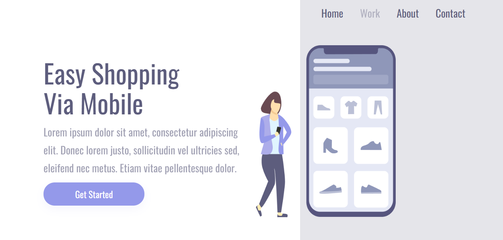
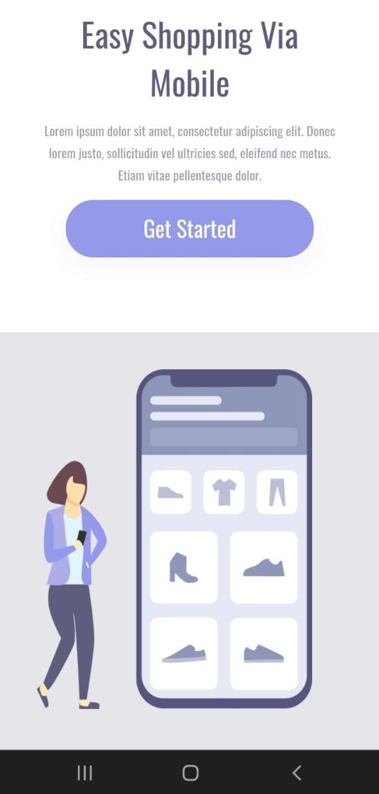

# Shopping

Desafio de código desenvolvido durante o módulo Front-End da formação Full Stack Dev Club. Projeto desenvolvido com HTML e CSS abordando conceitos de responsividade 
com media queries.

🔗 [Click here to access](https://n4ju15.github.io/shopping/)

### Versão para Desktop

### Versão para Mobile

## Tecnologias

- HTML
- CSS
- Media query
- Git and Github
